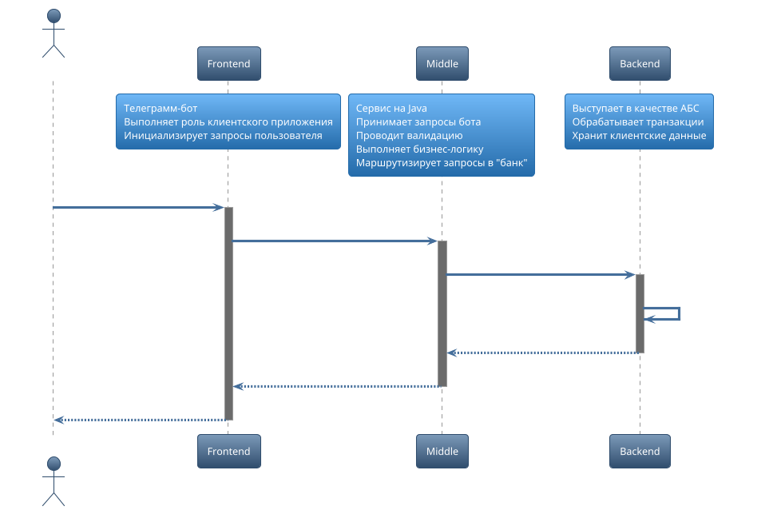

<h1 align="center">"Мини-банк" чат-бот для Telegram</h1>

 Создано в рамках обучения в академии Backend-разработки <a href="https://gpb.fut.ru/itfactory/backend"> GPB IT Factory</a>

<h1 id="contents">Оглавление</h1>

1. [О проекте](#1)
2. [Начало работы](#2)
3. [Необходимые компоненты](#3)
4. [Скачивание и установка](#4)
5. [Используемые команды и примеры](#5)
6. [Контакты](#6)
7. [To Do](#7)

<h2 id="1">О проекте</h2>

Данный проект представляет собой часть банковского приложения\
Telegram-бот — это Frontend часть "мини-банка", инициализирующая запросы пользователя для работы с Backend, посредством определенного списка команд\
Полная схема "мини-банка":

[Вверх :arrow_up:](#contents)

<h2 id="2">Начало работы</h2>

:warning: Раздел в разработке

Для начала работы убедитесь в наличии установленной Java версии 17+ и Git\
Для работы данного проекта необходимо зарегистрировать своего бота. Сделать это вы можете найдя в телеграмме [@BotFather](https://t.me/BotFather).\
Получив ток и имя своего бота, приступайте к установке.

[Вверх :arrow_up:](#contents)

<h2 id="3">Необходимые компоненты</h2>

:warning: Новые компоненты будут добавляться по мере развития проекта

- [Java 17+](https://www.java.com/ru/)
- [Gradle 7.4/8.7](https://www.gradle.org/)
- [SpringBoot](https://www.spring.io/projects/spring-boot)  

[Вверх :arrow_up:](#contents)

<h2 id="4">Скачивание и установка</h2>

:warning: Раздел в разработке\
Для скачивания репозитория используйте в PowerShell команду:  git clone https://github.com/gpb-it-factory/elenberger-telergam-bot \
Далее установите переменные окружения. Для этого откройте свойства вашего компьютера. Перейдите в меню **"Advanced System Settings"** и нажмите кнопку **"Enviroment Variables"**\
Для корректной работы бота необходимо создать переменную\
**TELEGRAM_BOT_NAME**, которая содержит имя вашего бота\
и **TELEGRAM_BOT_TOKEN**, которая содержит токен вашего бота.\
Для запуска приложения в PowerShell перейдите в каталог со склонированным репозиторием и используйте команду: **./gradlew bootRun**

[Вверх :arrow_up:](#contents)

<h2 id="5">Используемые команды и примеры</h2>

:warning: Будут добавляться по мере развития функционала \
В данный момент доступны команды:\
**/start** - начинает работу с ботом\
**/ping** - дает в ответ pong\
**/help** - команда в разработке, будет выводить список доступных действий

[Вверх :arrow_up:](#contents)

<h2 id="6">Контакты</h2>

E-mail: [elnberg2397@gmail.com](mailto:elnberg2397@gmail.com)  
Telegram: [LohmatiyShmel](https://t.me/LohmatiyShmel)  

[Вверх :arrow_up:](#contents)

<h2 id="7">To Do</h2>

Учет текущих задач по проекту
- [x] Задача 1. Создать репозиторий для telegram-бота
- [x] Задача 2. Добавить ReadMe
- [ ] Задача 3. Создать "скелет" бота
- [ ] .... TBD

[Вверх :arrow_up:](#contents)